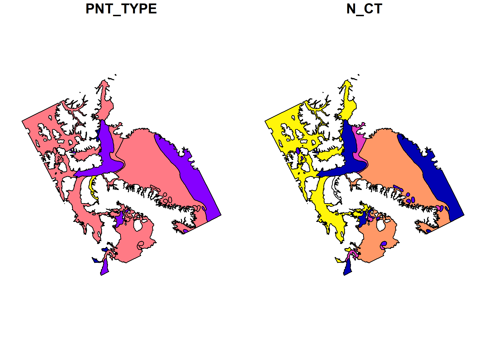
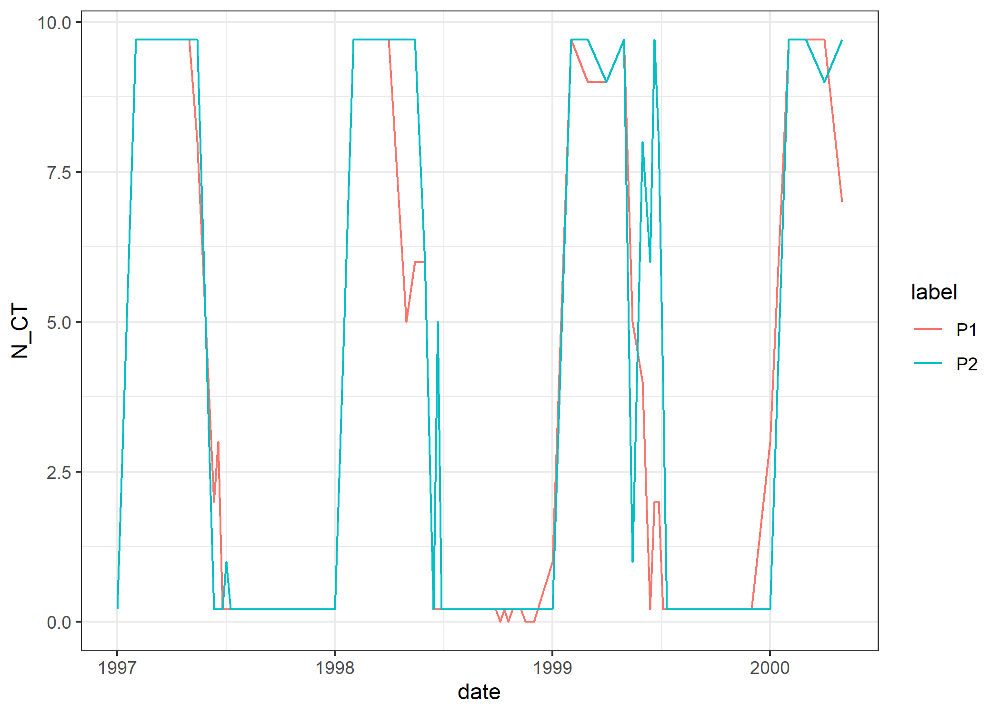
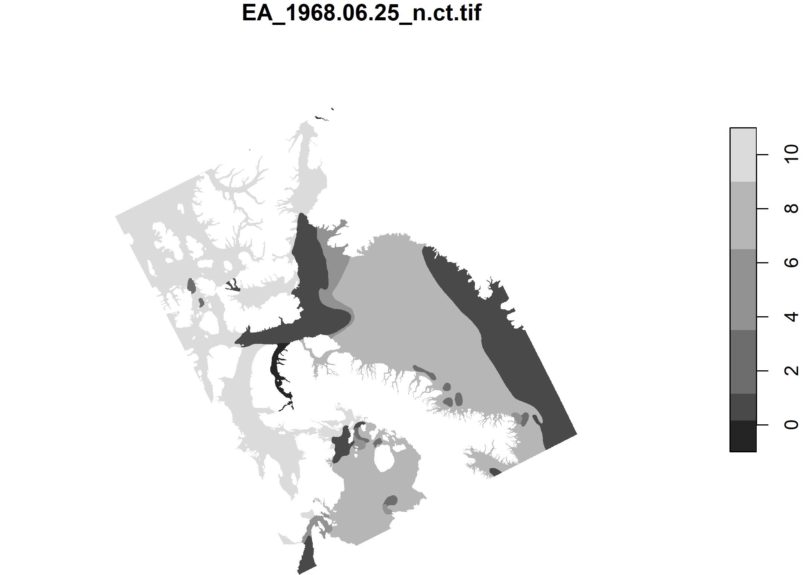
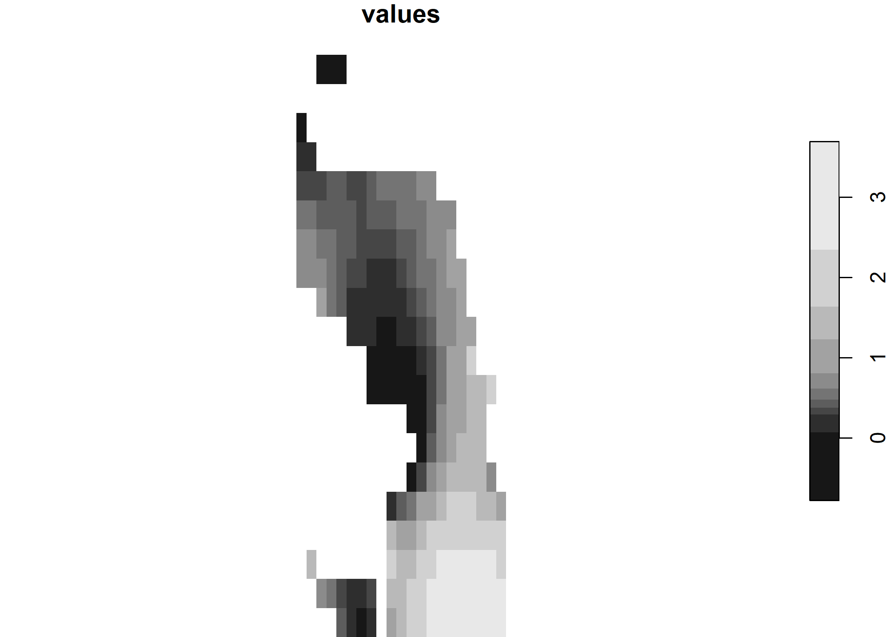
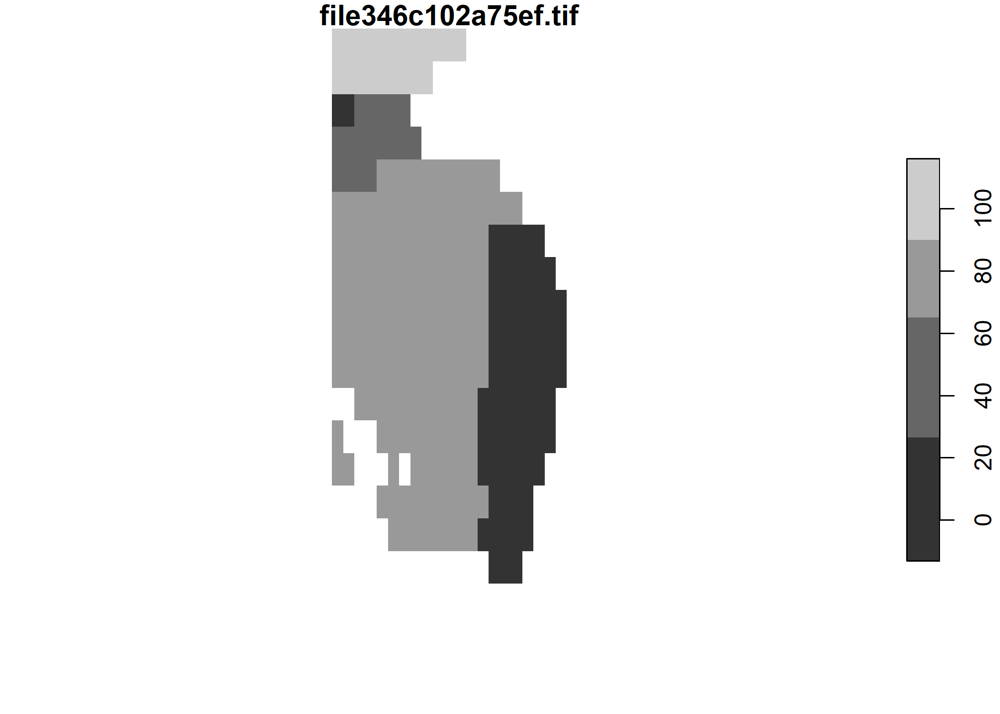
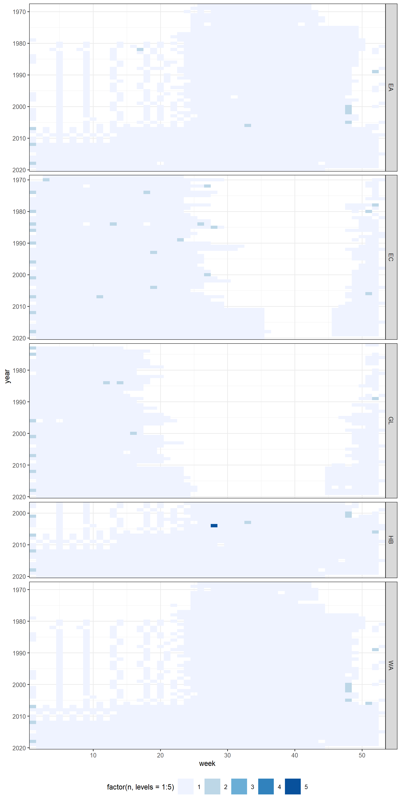

CIS Data Processing
================

This repo is an archive of the entire ice polygon dataset from the
Canadian Ice Service, which can be downloaded piecemeal using the [CIS
search tool](https://iceweb1.cis.ec.gc.ca/Archive/page1.xhtml). Use
zip/meta.csv search for the existence of an ice polygon map (the `url`
column contains the URL from which it can be downloaded). Use
file-download.R to download the whole data set (about 14.8 GB
uncompressed, 4.8 GB zipped) and gpkg.collect.R to convert files to
.gpkg layers (which load 50-100 times faster than the raw .e00 files).

All of the geometry files are .gitignored (too big for a GitHub repo),
but (some) are available in the shared directory on Eric’s server.

  - zip/: Contains zip files downloaded from the search tool.
  - file/: Where all zip files were extracted (2020-01-20 onward .zip
    files contain .zip files, which are also extracted to file/ as
    shapefiles). These can be downloaded using file-download.R.
  - gpkg/: A raw conversion of .e00 and .shp files in file/ to
    geopackage format with human-readable names.
  - gpkg-standardized/: Like gpkg/ but with numeric columns as numbers,
    blank values as missings (NULLs), identical column names for all
    files, and standardized to the CRS of the most recent CIS files
    (Lambert Conformal Conic, WGS84).
  - tif/: Rasterized versions of gpkg-standardized/. Currently the only
    attribute considered is `N_CT` (total ice concentration as a numeric
    value). All .tif files have identical grid extent and size (per
    region). All .tif files are standardized to the CRS of the most
    recent CIS files (Lambert Conformal Conic, WGS84).

## Examples in R

Using the [tidyverse](https://tidyverse.org) (for working with tables;
has [excellent learning materials](https://r4ds.had.co.nz)),
[sf](https://r-spatial.github.io/sf) (for working with vector geometry),
and [stars](https://r-spatial.github.io/stars) (for working with raster
geometry with a time component).

``` r
library(tidyverse)
library(sf)
library(stars)
```

Read a .gpkg file:

``` r
(poly <- read_sf("gpkg-standardized/EA_1968-06-25.gpkg"))
```

    ## Simple feature collection with 161 features and 37 fields
    ## geometry type:  POLYGON
    ## dimension:      XY
    ## bbox:           xmin: -294110.3 ymin: 2704486 xmax: 1856465 ymax: 5028139
    ## projected CRS:  WGS_1984_Lambert_Conformal_Conic
    ## # A tibble: 161 x 38
    ##    region date       PNT_TYPE E_CT  E_CA  E_CB  E_CC  E_CD  E_SO  E_SA  E_SB 
    ##    <chr>  <date>        <dbl> <chr> <chr> <chr> <chr> <chr> <chr> <chr> <chr>
    ##  1 EA     1968-06-25      118 10    <NA>  <NA>  <NA>  <NA>  <NA>  6     <NA> 
    ##  2 EA     1968-06-25      900 <NA>  <NA>  <NA>  <NA>  <NA>  <NA>  <NA>  <NA> 
    ##  3 EA     1968-06-25      900 <NA>  <NA>  <NA>  <NA>  <NA>  <NA>  <NA>  <NA> 
    ##  4 EA     1968-06-25      123 <NA>  <NA>  <NA>  <NA>  <NA>  <NA>  <NA>  <NA> 
    ##  5 EA     1968-06-25      900 <NA>  <NA>  <NA>  <NA>  <NA>  <NA>  <NA>  <NA> 
    ##  6 EA     1968-06-25      123 <NA>  <NA>  <NA>  <NA>  <NA>  <NA>  <NA>  <NA> 
    ##  7 EA     1968-06-25      123 <NA>  <NA>  <NA>  <NA>  <NA>  <NA>  <NA>  <NA> 
    ##  8 EA     1968-06-25      118 10    <NA>  <NA>  <NA>  <NA>  <NA>  6     <NA> 
    ##  9 EA     1968-06-25      123 <NA>  <NA>  <NA>  <NA>  <NA>  <NA>  <NA>  <NA> 
    ## 10 EA     1968-06-25      900 <NA>  <NA>  <NA>  <NA>  <NA>  <NA>  <NA>  <NA> 
    ## # ... with 151 more rows, and 27 more variables: E_SC <chr>, E_SD <chr>,
    ## #   E_SE <chr>, E_FA <chr>, E_FB <chr>, E_FC <chr>, E_FD <chr>, E_FE <chr>,
    ## #   E_CS <chr>, N_CT <dbl>, N_COI <dbl>, N_CMY <dbl>, N_CSY <dbl>, N_CFY <dbl>,
    ## #   N_CFY_TK <dbl>, N_CFY_M <dbl>, N_CFY_TN <dbl>, N_CYI <dbl>, N_CGW <dbl>,
    ## #   N_CG <dbl>, N_CN <dbl>, N_CB <dbl>, N_CVTK <dbl>, N_CTK <dbl>, N_CM <dbl>,
    ## #   N_CTN <dbl>, geom <POLYGON [m]>

``` r
poly %>% 
  filter(PNT_TYPE < 400) %>% 
  select(PNT_TYPE, N_CT) %>% 
  plot()
```

<!-- -->

Extract values at points of interest (best to use vector data for this):

``` r
gpkg_hb_files <- list.files("gpkg-standardized", "^HB", full.names = TRUE)
gpkg_hb <- gpkg_hb_files %>% 
  head(100) %>% 
  map_dfr(read_sf)

target_locations <- tibble(
  label = c("P1", "P2"),
  longitude = c(-56.47, -60.43),
  latitude = c(54.85, 57.13)
) %>% 
  st_as_sf(coords = c("longitude", "latitude"), crs = 4326) %>% 
  st_transform(st_crs(gpkg_hb))

(intersected <- st_intersection(target_locations, gpkg_hb))
```

    ## Warning: attribute variables are assumed to be spatially constant throughout all
    ## geometries

    ## Simple feature collection with 200 features and 38 fields
    ## geometry type:  POINT
    ## dimension:      XY
    ## bbox:           xmin: 2191885 ymin: 2568163 xmax: 2534903 ymax: 2618399
    ## projected CRS:  WGS_1984_Lambert_Conformal_Conic
    ## # A tibble: 200 x 39
    ##    label region date       PNT_TYPE E_CT  E_CA  E_CB  E_CC  E_CD  E_SO  E_SA 
    ##  * <chr> <chr>  <date>        <dbl> <chr> <chr> <chr> <chr> <chr> <chr> <chr>
    ##  1 P1    HB     1997-01-01      101 <NA>  <NA>  <NA>  <NA>  <NA>  <NA>  <NA> 
    ##  2 P2    HB     1997-01-01      101 <NA>  <NA>  <NA>  <NA>  <NA>  <NA>  <NA> 
    ##  3 P2    HB     1997-02-01      118 9+    3     6     1     <NA>  7.    1.   
    ##  4 P1    HB     1997-02-01      118 9+    3     5     2     <NA>  7.    7    
    ##  5 P1    HB     1997-03-01      118 9+    3     7     <NA>  <NA>  7.    1.   
    ##  6 P2    HB     1997-03-01      118 9+    2     6     2     <NA>  7.    7    
    ##  7 P1    HB     1997-04-01      118 9+    5     5     <NA>  <NA>  7.    4.   
    ##  8 P2    HB     1997-04-01      118 9+    5     5     <NA>  <NA>  7.    4.   
    ##  9 P2    HB     1997-05-01      118 9+    5     5     <NA>  <NA>  7.    4.   
    ## 10 P1    HB     1997-05-01      118 9+    5     5     <NA>  <NA>  7.    4.   
    ## # ... with 190 more rows, and 28 more variables: E_SB <chr>, E_SC <chr>,
    ## #   E_SD <chr>, E_SE <chr>, E_FA <chr>, E_FB <chr>, E_FC <chr>, E_FD <chr>,
    ## #   E_FE <chr>, E_CS <chr>, N_CT <dbl>, N_COI <dbl>, N_CMY <dbl>, N_CSY <dbl>,
    ## #   N_CFY <dbl>, N_CFY_TK <dbl>, N_CFY_M <dbl>, N_CFY_TN <dbl>, N_CYI <dbl>,
    ## #   N_CGW <dbl>, N_CG <dbl>, N_CN <dbl>, N_CB <dbl>, N_CVTK <dbl>, N_CTK <dbl>,
    ## #   N_CM <dbl>, N_CTN <dbl>, geometry <POINT [m]>

``` r
ggplot(intersected, aes(date, N_CT, col = label)) +
  geom_line() +
  theme_bw()
```

<!-- -->

Read a .tif file (note that `N_CT` values were multiplied by 10 to take
advantage of storing them more efficiently as 8-bit integers):

``` r
(rst <- read_stars("tif/n-ct/EA_1968-06-25_n-ct.tif"))
```

    ## stars object with 2 dimensions and 1 attribute
    ## attribute(s), summary of first 1e+05 cells:
    ##  EA_1968-06-25_n-ct.tif 
    ##  Min.   : NA            
    ##  1st Qu.: NA            
    ##  Median : NA            
    ##  Mean   :NaN            
    ##  3rd Qu.: NA            
    ##  Max.   : NA            
    ##  NA's   :1e+05          
    ## dimension(s):
    ##   from   to  offset delta                       refsys point values    
    ## x    1 2299 -295000  1000 WGS_1984_Lambert_Conforma... FALSE   NULL [x]
    ## y    1 2568 5270000 -1000 WGS_1984_Lambert_Conforma... FALSE   NULL [y]

``` r
st_bbox(rst)
```

    ##    xmin    ymin    xmax    ymax 
    ## -295000 2702000 2004000 5270000

``` r
plot(rst)
```

<!-- -->

``` r
# do math (can include other rasters)
plot(rst / 10)
```

<!-- -->

``` r
# work with matrix version
mat <- as.matrix(rst)[[1]]
str(mat)
```

    ##  num [1:2299, 1:2568] NA NA NA NA NA NA NA NA NA NA ...

``` r
mean(mat, na.rm = TRUE)
```

    ## [1] 67.06838

Align to an existing data set using `st_warp()` (a wrapper around [GDAL
warp](https://gdal.org/programs/gdalwarp.html)). See the resampling
method section for resampling options.

``` r
data("levitus", package ="ocedata")

sst <- st_as_stars(
  st_bbox(c(xmin = -180, ymin = -89.5, xmax = 180, ymax = 89.5), crs = 4326),
  nx = length(levitus$longitude), ny = length(levitus$latitude),
  # stars expects reversed in the latitude direction
  values = levitus$SST[, rev(seq_along(levitus$latitude))]
)

bbox_latlon <- st_bbox(
  c(xmin = -73, ymin = 60, xmax = -52, ymax = 80),
  crs = 4326
)

levitus_study_area <- st_crop(sst, bbox_latlon)
```

    ## although coordinates are longitude/latitude, st_intersects assumes that they are planar

``` r
rst_study_area <- st_warp(rst, levitus_study_area, use_gdal = TRUE, method = "mode")

plot(levitus_study_area)
```

<!-- -->

``` r
plot(rst_study_area)
```

<!-- -->

## Dataset details

Without downloading any files, you can use zip/meta.csv, gpkg/meta.csv,
gpkg-standardized/meta.csv, and attrs.parquet to examine file metadata.

``` r
(zip_meta <- read_csv("zip/meta.csv", col_types = cols()))
```

    ## # A tibble: 7,457 x 9
    ##    region date       region_code zip    file    file_size gpkg   dsn    url     
    ##    <chr>  <date>     <chr>       <chr>  <chr>       <dbl> <chr>  <chr>  <chr>   
    ##  1 EA     1968-06-25 a11         zip/c~ file/r~    959470 gpkg/~ file/~ https:/~
    ##  2 EA     1968-07-02 a11         zip/c~ file/r~    965518 gpkg/~ file/~ https:/~
    ##  3 EA     1968-07-11 a11         zip/c~ file/r~   1017642 gpkg/~ file/~ https:/~
    ##  4 EA     1968-07-18 a11         zip/c~ file/r~   1047520 gpkg/~ file/~ https:/~
    ##  5 EA     1968-07-25 a11         zip/c~ file/r~   1110248 gpkg/~ file/~ https:/~
    ##  6 EA     1968-08-01 a11         zip/c~ file/r~   1150445 gpkg/~ file/~ https:/~
    ##  7 EA     1968-08-08 a11         zip/c~ file/r~   1198997 gpkg/~ file/~ https:/~
    ##  8 EA     1968-08-15 a11         zip/c~ file/r~   1186817 gpkg/~ file/~ https:/~
    ##  9 EA     1968-08-22 a11         zip/c~ file/r~   1147764 gpkg/~ file/~ https:/~
    ## 10 EA     1968-08-29 a11         zip/c~ file/r~   1111434 gpkg/~ file/~ https:/~
    ## # ... with 7,447 more rows

On average, there is one file per region per week. In 1983 the coding
for some columns was changed, in (roughly) 1997 the HB region was added,
and in (roughly) 2004, the CIS started producing all maps on Monday with
internally-consistent polygons between overlapping regions.

<!-- -->

``` r
(gpkg_standardized_meta <- read_csv(
  "gpkg-standardized/meta.csv", 
  col_types = cols()
))
```

    ## # A tibble: 7,429 x 7
    ##    gpkg_standardiz~ gpkg  gpkg_n_features gpkg_xmin gpkg_ymin gpkg_xmax
    ##    <chr>            <chr>           <dbl>     <dbl>     <dbl>     <dbl>
    ##  1 gpkg-standardiz~ gpkg~             161  -294124.   2704501  1856543.
    ##  2 gpkg-standardiz~ gpkg~             165  -294124.   2704501  1856543.
    ##  3 gpkg-standardiz~ gpkg~             186  -294124.   2704501  1856543.
    ##  4 gpkg-standardiz~ gpkg~             201  -294124.   2704501  1856543.
    ##  5 gpkg-standardiz~ gpkg~             229  -294124.   2704501  1856543.
    ##  6 gpkg-standardiz~ gpkg~             255  -294124.   2704501  1856543.
    ##  7 gpkg-standardiz~ gpkg~             258  -294124.   2704501  1856543.
    ##  8 gpkg-standardiz~ gpkg~             260  -294124.   2704501  1856543.
    ##  9 gpkg-standardiz~ gpkg~             250  -294124.   2704501  1856543.
    ## 10 gpkg-standardiz~ gpkg~             240  -294124.   2704501  1856543.
    ## # ... with 7,419 more rows, and 1 more variable: gpkg_ymax <dbl>

Also included is the collected attribute table from all files as a
parquet file (because it’s too big as a compressed CSV). You can use
this to query relevant files based on attribute values and/or an area of
interest before downloading any files. The CRS for coordinates in
attrs.parquet is the same as those in gpkg-standardized/ (Lambert
Conformal Conic, WGS84).

``` r
library(arrow)
```

    ## Warning: package 'arrow' was built under R version 4.0.3

    ## 
    ## Attaching package: 'arrow'

    ## The following object is masked from 'package:utils':
    ## 
    ##     timestamp

``` r
(attrs <- read_parquet("attrs.parquet"))
```

    ## # A tibble: 1,820,631 x 86
    ##    region date       feat_id feat_xmin feat_ymin feat_xmax feat_ymax    AREA
    ##    <chr>  <date>       <dbl>     <dbl>     <dbl>     <dbl>     <dbl>   <dbl>
    ##  1 EA     1968-06-25       1  -294110.  3934007.   419581.  4653566. 1.75e11
    ##  2 EA     1968-06-25       2   596506.  3983926.  1496794.  5028139. 4.45e11
    ##  3 EA     1968-06-25       3    63119.  4219631.   316434.  4576411. 4.43e10
    ##  4 EA     1968-06-25       4   111205.  4570798.   113114.  4573476. 2.74e 6
    ##  5 EA     1968-06-25       5   157003.  4034800.   579976.  4801872. 1.65e11
    ##  6 EA     1968-06-25       6   710878.  4864759.   725815.  4876208. 6.42e 7
    ##  7 EA     1968-06-25       7   634939.  4816370.   699696.  4838190. 2.91e 8
    ##  8 EA     1968-06-25       8   450848.  4336443.   693805.  4818802. 4.02e10
    ##  9 EA     1968-06-25       9   329854.  4677901.   337814.  4682922. 1.58e 7
    ## 10 EA     1968-06-25      10    71723.  4488150.    93596.  4498599. 1.34e 8
    ## # ... with 1,820,621 more rows, and 78 more variables: PERIMETER <dbl>,
    ## #   ARCE00_COV. <int>, ARCE00_COV.ID <int>, A_LEGEND <chr>, REGION <chr>,
    ## #   DATE_CARTE <chr>, SOURCE <chr>, MOD <chr>, EGG.ID <int>, PNT_TYPE <dbl>,
    ## #   EGG_NAME <chr>, EGG_SCALE <int>, EGG_ATTR <chr>, USER_ATTR <chr>,
    ## #   ROTATION <int>, E_CT <chr>, E_CA <chr>, E_CB <chr>, E_CC <chr>, E_CD <chr>,
    ## #   E_SO <chr>, E_SA <chr>, E_SB <chr>, E_SC <chr>, E_SD <chr>, E_SE <chr>,
    ## #   E_FA <chr>, E_FB <chr>, E_FC <chr>, E_FD <chr>, E_FE <chr>, E_CS <chr>,
    ## #   N_CT <dbl>, N_COI <dbl>, N_CMY <dbl>, N_CSY <dbl>, N_CFY <dbl>,
    ## #   N_CFY_TK <dbl>, N_CFY_M <dbl>, N_CFY_TN <dbl>, N_CYI <dbl>, N_CGW <dbl>,
    ## #   N_CG <dbl>, N_CN <dbl>, N_CB <dbl>, EGG_ID <int>, SGD_CT <chr>,
    ## #   SGD_CA <chr>, SGD_SA <chr>, SGD_FA <chr>, SGD_CB <chr>, SGD_SB <chr>,
    ## #   SGD_FB <chr>, SGD_CC <chr>, SGD_SC <chr>, SGD_FC <chr>, SGD_CN <chr>,
    ## #   SGD_CD <chr>, SGD_CF <chr>, SGD_POLY_T <chr>, CT <chr>, CA <chr>, SA <chr>,
    ## #   FA <chr>, CB <chr>, SB <chr>, FB <chr>, CC <chr>, SC <chr>, FC <chr>,
    ## #   CN <chr>, CD <chr>, CF <chr>, POLY_TYPE <chr>, N_CVTK <dbl>, N_CTK <dbl>,
    ## #   N_CM <dbl>, N_CTN <dbl>

### CRS

The files in the archive appear to specify at least 4 coordinate
reference systems. In some cases a coordinate reference system was not
specified. All coordinate systems are lambert conformal conics with
standard parallels at 49 and 77 north latitude with a central meridian
at 100 degrees west longitude (latitude of origin: 40 degrees north
latitude), however, they differ with respect to the datum/ellipsoid used
to define the meridians/standard parallels. Since 2020-01-20 (when the
CIS started distributing shapefiles), the WGS84 datum has been used.
Prior to this date, it is likely that NAD27 was used to define the
lambert conformal conic (except for several weeks during 2014 in the
Great Lakes region).

``` r
gpkg_meta <- read_csv("gpkg/meta.csv", col_types = cols())
gpkg_meta %>%
  mutate(gpkg_crs = str_replace_all(gpkg_crs, "meters", "METERS")) %>% 
  count(gpkg_crs) %>% 
  rev()
```

    ## # A tibble: 5 x 2
    ##       n gpkg_crs                                                                
    ##   <int> <chr>                                                                   
    ## 1  3829 "PROJCS[\"unnamed\",GEOGCS[\"NAD27\",DATUM[\"North_American_Datum_1927\~
    ## 2  3404 "PROJCS[\"unnamed\",GEOGCS[\"Unknown datum based upon the Clarke 1866 e~
    ## 3    12 "PROJCS[\"unnamed\",GEOGCS[\"WGS 84\",DATUM[\"WGS_1984\",SPHEROID[\"WGS~
    ## 4   176 "PROJCS[\"WGS_1984_Lambert_Conformal_Conic\",GEOGCS[\"WGS 84\",DATUM[\"~
    ## 5     8  <NA>

### Attributes

A documentation of the SIGRID vector file format (i.e., .gpkg files in
gpkg/) can be found
[here](https://www.jcomm.info/index.php?option=com_oe&task=viewDocumentRecord&docID=4439);
[a guide specific to the Canadian Ice
Service](https://www.canada.ca/en/environment-climate-change/services/ice-forecasts-observations/latest-conditions/archive-overview/information-about-data.html)
is also available. See also the [Ice
glossary](https://www.canada.ca/en/environment-climate-change/services/ice-forecasts-observations/latest-conditions/glossary.html)
provided by the Canadian Ice Service. The column names are the same for
files between 1968 and present, but in 2020 there was a shift in data
formats and only some columns were retained. In 1983 the `R_*` columns
stopped being used.

The `E_*` columns (probably for “egg”) are present in all ice polygon
files. These are string codes where the empty string `''` is used both
for “blank” and “0”.

  - `E_CA` (Partial concentration of thickest ice): ’‘, ’1’, ‘2’, ‘3’,
    ‘4’, ‘5’, ‘6’, ‘7’, ‘8’, ‘9’
  - `E_CB` (Partial concentration of second thickest ice): ’‘, ’1’, ‘2’,
    ‘3’, ‘4’, ‘5’, ‘6’, ‘7’, ‘8’, ‘9’
  - `E_CC` (Partial concentration of the third thickest ice): ’‘, ’1’,
    ‘2’, ‘3’, ‘4’, ‘5’, ‘6’, ‘7’, ‘8’
  - `E_CD` (Stage of development of any remaining class of ice
    (corresponds to Sd): ’‘, ’1’, ‘2’, ‘3’, ‘4’, ‘5’, ‘6’
  - `E_CS`: ’‘, ’1’, ‘10’, ‘2’, ‘3’, ‘4’, ‘5’, ‘6’, ‘7’, ‘8’, ‘9’, ‘9+’
  - `E_CT` (Total concentration): ’‘, ’0.’, ‘1’, ‘10’, ‘2’, ‘3’, ‘4’,
    ‘5’, ‘6’, ‘7’, ‘8’, ‘9’, ‘9+’
  - `E_FA` (Form of thickest ice): ’‘, ’1’, ‘2’, ‘3’, ‘4’, ‘5’, ‘6’,
    ‘7’, ‘8’, ‘9’, ‘X’
  - `E_FB` (Form of second thickest ice): ’‘, ’1’, ‘2’, ‘3’, ‘4’, ‘5’,
    ‘6’, ‘7’, ‘8’, ‘9’, ‘X’
  - `E_FC` (Form of third thickest ice): ’‘, ’0’, ‘1’, ‘2’, ‘3’, ‘4’,
    ‘5’, ‘6’, ‘7’, ‘8’, ‘X’
  - `E_FD` (Form of any remaining class of ice): ’’ (blank everywhere)
  - `E_FE`: ’’ (blank everywhere)
  - `E_SA` Stage of development of thickest ice): ’‘, ’1’, ‘1.’, ‘3’,
    ‘4’, ‘4.’, ‘5’, ‘6’, ‘7’, ‘7.’, ‘8.’, ‘9.’
  - `E_SB` (Stage of development of second thickest Ice): ’‘, ’1’, ‘1.’,
    ‘2’, ‘4’, ‘4.’, ‘5’, ‘6’, ‘7’, ‘7.’, ‘8.’, ‘X’
  - `E_SC` (Stage of development of third thickest Ice): ’‘, ’1’, ‘1.’,
    ‘2’, ‘3’, ‘4’, ‘4.’, ‘5’, ‘7’
  - `E_SD` (Stage of development of any remaining class of ice): ’‘,
    ’1’, ‘4’, ‘4.’, ‘5’, ‘7’
  - `E_SE`: ’’ (blank everywhere)
  - `E_SO` (stage of development of ice found in traces): ’‘, ’1.’, ‘4’,
    ‘4.’, ‘5’, ‘6’, ‘7’, ‘7.’, ‘8.’, ‘9.’

Numeric values (here ’’ is blank whereas 0.0 is 0):

  - `N_CB` (numeric value for the concentration of icebergs): ’‘,’ 0.2’,
    ‘10.0’
  - `N_CFY` (numeric value for the concentration of first year ice):
    ’‘,’ 0.0’, ’ 0.3’, ’ 1.0’, ’ 1.3’, ’ 2.0’, ’ 2.3’, ’ 3.0’, ’
    3.3’, ’ 4.0’, ’ 4.3’, ’ 5.0’, ’ 5.3’, ’ 6.0’, ’ 6.3’, ’ 7.0’, ’
    7.3’, ’ 8.0’, ’ 8.3’, ’ 9.0’, ’ 9.3’, ’ 9.7’, ‘10.0’
  - `N_CG` (numeric value for the concentration of grey ice): ’‘,’ 0.0’,
    ’ 0.3’, ’ 1.0’, ’ 2.0’, ’ 3.0’, ’ 4.0’, ’ 5.0’, ’ 6.0’, ’ 7.0’, ’
    8.0’, ’ 9.0’, ’ 9.7’, ‘10.0’
  - `N_CGW` (numeric value for the concentration o grey white ice): ’‘,’
    0.0’, ’ 0.3’, ’ 1.0’, ’ 2.0’, ’ 3.0’, ’ 4.0’, ’ 5.0’, ’ 6.0’, ’
    7.0’, ’ 8.0’, ’ 9.0’, ’ 9.7’, ‘10.0’
  - `N_CMY` (numeric value for the concentration of multi-year ice):
    ’‘,’ 0.0’, ’ 0.3’, ’ 1.0’, ’ 2.0’, ’ 3.0’, ’ 4.0’, ’ 5.0’, ’
    6.0’, ’ 7.0’, ’ 8.0’, ’ 9.0’, ’ 9.7’, ‘10.0’
  - `N_CN` (numeric value for the concentration of new ice): ’‘,’ 0.0’,
    ’ 0.3’, ’ 1.0’, ’ 2.0’, ’ 3.0’, ’ 4.0’, ’ 5.0’, ’ 6.0’, ’ 7.0’, ’
    8.0’, ’ 9.0’, ’ 9.7’, ‘10.0’
  - `N_COI` (numeric value for the concentration of old ice): ’‘,’ 0.0’,
    ’ 0.3’, ’ 0.6’, ’ 1.0’, ’ 1.3’, ’ 2.0’, ’ 2.3’, ’ 3.0’, ’ 3.3’, ’
    4.0’, ’ 4.3’, ’ 5.0’, ’ 5.3’, ’ 6.0’, ’ 6.3’, ’ 7.0’, ’ 7.3’, ’
    8.0’, ’ 8.3’, ’ 9.0’, ’ 9.3’, ’ 9.7’, ‘10.0’
  - `N_CSY` (numeric value for the concentration of second year ice):
    ’‘,’ 0.0’, ’ 0.3’, ’ 1.0’, ’ 2.0’, ’ 3.0’, ’ 4.0’, ’ 5.0’, ’
    6.0’, ’ 7.0’, ’ 8.0’, ’ 9.0’, ’ 9.7’, ‘10.0’
  - `N_CT` (numeric value for total concentration): ’‘,’ 0.0’, ’ 0.2’, ’
    0.3’, ’ 1.0’, ’ 2.0’, ’ 3.0’, ’ 4.0’, ’ 5.0’, ’ 6.0’, ’ 7.0’, ’
    8.0’, ’ 9.0’, ’ 9.7’, ‘10.0’
  - `N_CYI` (numeric value for the concentration of young ice): ’‘,’
    0.0’, ’ 0.3’, ’ 0.6’, ’ 1.0’, ’ 1.3’, ’ 2.0’, ’ 2.3’, ’ 3.0’, ’
    3.3’, ’ 4.0’, ’ 4.3’, ’ 5.0’, ’ 5.3’, ’ 6.0’, ’ 6.3’, ’ 7.0’, ’
    7.3’, ’ 8.0’, ’ 8.3’, ’ 9.0’, ’ 9.3’, ’ 9.7’, ‘10.0’

Prior to 1983, the following “ratio codes” were used. These appear to
correspond mostly to the “numeric” codes, but are no longer documented.

  - `R_CFY`: ’‘,’/‘, ’0’, ‘1’, ‘2’, ‘3’, ‘4’, ‘5’, ‘6’, ‘7’, ‘8’, ‘9’,
    ‘F’
  - `R_CG`: ’‘,’/‘, ’0’, ‘1’, ‘2’, ‘3’, ‘4’, ‘5’, ‘6’, ‘7’, ‘8’, ‘9’,
    ‘F’
  - `R_CGW`: ’‘,’/‘, ’0’, ‘1’, ‘2’, ‘3’, ‘4’, ‘5’, ‘6’, ‘7’, ‘8’, ‘9’,
    ‘F’
  - `R_CMY`: ’‘,’/‘, ’0’, ‘1’, ‘2’, ‘3’, ‘4’, ‘5’, ‘6’, ‘7’, ‘8’, ‘9’,
    ‘F’
  - `R_CN`: ’‘,’/‘, ’0’, ‘1’, ‘2’, ‘3’, ‘4’, ‘5’, ‘6’, ‘7’, ‘8’, ‘9’,
    ‘F’
  - `R_CS`: ’‘,’ 1’, ’ 2’, ’ 3’, ’ 4’, ’ 5’, ’ 6’, ’ 7’, ’ 8’, ’ 9’,
    ‘10’, ‘9+’
  - `R_CSY`: ’‘,’/‘, ’0’, ‘1’, ‘2’, ‘3’, ‘4’, ‘5’, ‘6’, ‘7’, ‘8’, ‘9’,
    ‘F’
  - `R_CT`: ’‘,’ 1’, ’ 2’, ’ 3’, ’ 4’, ’ 5’, ’ 6’, ’ 7’, ’ 8’, ’ 9’,
    ‘10’, ‘4’, ‘9+’
  - `R_PFY`: ’‘,’/‘, ’0’, ‘1’, ‘2’, ‘3’, ‘4’, ‘5’, ‘6’, ‘7’, ‘8’, ‘9’,
    ‘F’
  - `R_PG`: ’‘,’/‘, ’1’, ‘2’, ‘3’, ‘4’, ‘5’, ‘6’, ‘7’, ‘8’, ‘9’, ‘F’
  - `R_PGW`: ’‘,’/‘, ’0’, ‘1’, ‘2’, ‘3’, ‘4’, ‘5’, ‘6’, ‘7’, ‘8’, ‘9’,
    ‘F’
  - `R_PMY`: ’‘,’/‘, ’0’, ‘1’, ‘2’, ‘3’, ‘4’, ‘5’, ‘6’, ‘7’, ‘8’, ‘9’,
    ‘F’
  - `R_PN`: ’‘,’/‘, ’0’, ‘1’, ‘2’, ‘3’, ‘4’, ‘5’, ‘6’, ‘7’, ‘8’, ‘9’,
    ‘F’
  - `R_PSY`: ’‘,’/‘, ’0’, ‘1’, ‘2’, ‘3’, ‘4’, ‘5’, ‘6’, ‘7’, ‘8’, ‘9’,
    ‘F’
  - `R_SFY`: ’‘,’/‘, ’0’, ‘1’, ‘2’, ‘3’, ‘4’, ‘5’, ‘6’, ‘7’, ‘8’, ‘9’,
    ‘F’
  - `R_SG`: ’‘,’/‘, ’0’, ‘1’, ‘2’, ‘3’, ‘4’, ‘5’, ‘6’
  - `R_SGW`: ’‘,’/‘, ’0’, ‘1’, ‘2’, ‘3’, ‘5’, ‘6’
  - `R_SMY`: ’‘,’/‘, ’0’, ‘1’, ‘2’, ‘3’, ‘4’, ‘5’, ‘6’, ‘7’, ‘8’, ‘F’
  - `R_SN`: ’‘,’/‘, ’0’, ‘1’, ‘2’, ‘3’, ‘4’, ‘5’, ‘6’, ‘7’, ‘8’, ‘9’,
    ‘F’
  - `R_SSY`: ’‘,’/‘, ’0’, ‘1’, ‘2’, ‘3’, ‘4’, ‘6’, ‘F’

Except for the `R_*` codes (which end in 1983), the columns have been
consistently used over time.

<!-- -->
