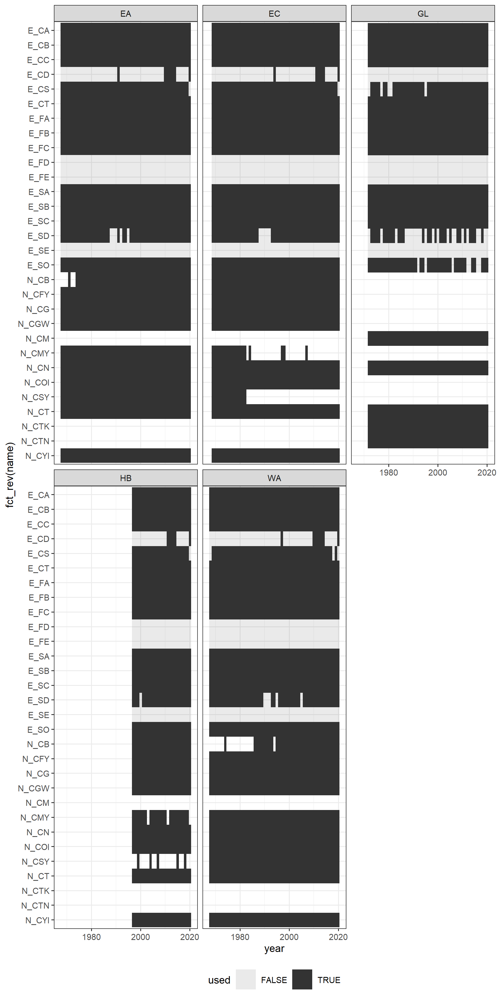

CIS Data Processing
================

This repo describes a pipeline for turning .zip files downloaded from
the [CIS search tool](https://iceweb1.cis.ec.gc.ca/Archive/page1.xhtml)
into usable data products that can be queried and loaded efficiently in
R. Roughly,

  - Add .zip files downloaded from the search tool to zip/
  - Run zip-collect.R
  - Run gpkg-collect.R
  - Run attrs-collect.R

Both zip-collect.R and gpkg-collect.R are sufficiently lazy such that
they do not decompress/load anything that has already been converted to
a gpkg. The result is a folder gpkg/ that contains easy-to-read (i.e.,
`sf::read_sf()`) .gpkg files and a highly queryable attribute table
(read using `arrow::read_parquet()`).

All of the geometry files are .gitignored because they don’t fit on
GitHub, but you can use the provided attrs.parquet and/or gpkg/meta.csv
and/or zip/meta.csv to download a subset of the data (urls for each data
source are provided in zip/meta.csv).

``` r
library(tidyverse)

read_csv("zip/meta.csv")
```

    ## 
    ## -- Column specification --------------------------------------------------------
    ## cols(
    ##   region = col_character(),
    ##   date = col_date(format = ""),
    ##   region_code = col_character(),
    ##   zip_file = col_character(),
    ##   file = col_character(),
    ##   file_size = col_double(),
    ##   gpkg = col_character(),
    ##   dsn = col_character(),
    ##   url = col_character()
    ## )

    ## # A tibble: 7,457 x 9
    ##    region date       region_code zip_file  file   file_size gpkg   dsn   url    
    ##    <chr>  <date>     <chr>       <chr>     <chr>      <dbl> <chr>  <chr> <chr>  
    ##  1 EA     1968-06-25 a11         zip/cis_~ file/~    959470 gpkg/~ file~ https:~
    ##  2 EA     1968-07-02 a11         zip/cis_~ file/~    965518 gpkg/~ file~ https:~
    ##  3 EA     1968-07-11 a11         zip/cis_~ file/~   1017642 gpkg/~ file~ https:~
    ##  4 EA     1968-07-18 a11         zip/cis_~ file/~   1047520 gpkg/~ file~ https:~
    ##  5 EA     1968-07-25 a11         zip/cis_~ file/~   1110248 gpkg/~ file~ https:~
    ##  6 EA     1968-08-01 a11         zip/cis_~ file/~   1150445 gpkg/~ file~ https:~
    ##  7 EA     1968-08-08 a11         zip/cis_~ file/~   1198997 gpkg/~ file~ https:~
    ##  8 EA     1968-08-15 a11         zip/cis_~ file/~   1186817 gpkg/~ file~ https:~
    ##  9 EA     1968-08-22 a11         zip/cis_~ file/~   1147764 gpkg/~ file~ https:~
    ## 10 EA     1968-08-29 a11         zip/cis_~ file/~   1111434 gpkg/~ file~ https:~
    ## # ... with 7,447 more rows

``` r
sf::read_sf("gpkg/EA_1968-06-25.gpkg")
```

    ## Simple feature collection with 161 features and 66 fields
    ## geometry type:  POLYGON
    ## dimension:      XY
    ## bbox:           xmin: -294124.1 ymin: 2704501 xmax: 1856543 ymax: 5028246
    ## projected CRS:  unnamed
    ## # A tibble: 161 x 67
    ##       AREA PERIMETER ARCE00_COV. ARCE00_COV.ID A_LEGEND REGION DATE_CARTE SOURCE
    ##      <dbl>     <dbl>       <int>         <int> <chr>    <chr>  <chr>      <chr> 
    ##  1 1.75e11 11537280            2             2 Remote ~ AE     19680625   "RATI~
    ##  2 4.45e11  6040027            3             3 Land     AE     19680625   ""    
    ##  3 4.43e10  2580854            4             4 Land     AE     19680625   ""    
    ##  4 2.74e 6     6919.           5             5 No data  AE     19680625   ""    
    ##  5 1.65e11  7528443            6             6 Land     AE     19680625   ""    
    ##  6 6.42e 7    43507.           7             7 No data  AE     19680625   ""    
    ##  7 2.91e 8   155819.           8             8 No data  AE     19680625   ""    
    ##  8 4.02e10  3011698            9             9 Remote ~ AE     19680625   "RATI~
    ##  9 1.58e 7    19627.          10            10 No data  AE     19680625   ""    
    ## 10 1.34e 8    52649.          11            11 Land     AE     19680625   ""    
    ## # ... with 151 more rows, and 59 more variables: MOD <chr>, EGG.ID <int>,
    ## #   PNT_TYPE <int>, EGG_NAME <chr>, EGG_SCALE <int>, EGG_ATTR <chr>,
    ## #   USER_ATTR <chr>, ROTATION <int>, E_CT <chr>, E_CA <chr>, E_CB <chr>,
    ## #   E_CC <chr>, E_CD <chr>, E_SO <chr>, E_SA <chr>, E_SB <chr>, E_SC <chr>,
    ## #   E_SD <chr>, E_SE <chr>, E_FA <chr>, E_FB <chr>, E_FC <chr>, E_FD <chr>,
    ## #   E_FE <chr>, E_CS <chr>, R_CT <chr>, R_CMY <chr>, R_CSY <chr>, R_CFY <chr>,
    ## #   R_CGW <chr>, R_CG <chr>, R_CN <chr>, R_PMY <chr>, R_PSY <chr>, R_PFY <chr>,
    ## #   R_PGW <chr>, R_PG <chr>, R_PN <chr>, R_CS <chr>, R_SMY <chr>, R_SSY <chr>,
    ## #   R_SFY <chr>, R_SGW <chr>, R_SG <chr>, R_SN <chr>, N_CT <chr>, N_COI <chr>,
    ## #   N_CMY <chr>, N_CSY <chr>, N_CFY <chr>, N_CFY_TK <chr>, N_CFY_M <chr>,
    ## #   N_CFY_TN <chr>, N_CYI <chr>, N_CGW <chr>, N_CG <chr>, N_CN <chr>,
    ## #   N_CB <chr>, geom <POLYGON [m]>

``` r
arrow::read_parquet("attrs.parquet")
```

    ## # A tibble: 1,820,631 x 86
    ##    region date       feat_id feat_xmin feat_ymin feat_xmax feat_ymax    AREA
    ##    <chr>  <date>       <dbl>     <dbl>     <dbl>     <dbl>     <dbl>   <dbl>
    ##  1 EA     1968-06-25       1  -294124.  3934064.   419601.  4653655  1.75e11
    ##  2 EA     1968-06-25       2   596533.  3983989.  1496861.  5028246. 4.45e11
    ##  3 EA     1968-06-25       3    63122.  4219701    316449.  4576497  4.43e10
    ##  4 EA     1968-06-25       4   111211.  4570884    113119.  4573562. 2.74e 6
    ##  5 EA     1968-06-25       5   157011.  4034862    580003.  4801968. 1.65e11
    ##  6 EA     1968-06-25       6   710912.  4864858.   725849   4876308. 6.42e 7
    ##  7 EA     1968-06-25       7   634969.  4816468.   699729   4838288  2.91e 8
    ##  8 EA     1968-06-25       8   450870.  4336518.   693837.  4818899  4.02e10
    ##  9 EA     1968-06-25       9   329870.  4677992    337830.  4683013  1.58e 7
    ## 10 EA     1968-06-25      10    71727.  4488232.    93600.  4498682. 1.34e 8
    ## # ... with 1,820,621 more rows, and 78 more variables: PERIMETER <dbl>,
    ## #   ARCE00_COV. <int>, ARCE00_COV.ID <int>, A_LEGEND <chr>, REGION <chr>,
    ## #   DATE_CARTE <chr>, SOURCE <chr>, MOD <chr>, EGG.ID <int>, PNT_TYPE <dbl>,
    ## #   EGG_NAME <chr>, EGG_SCALE <int>, EGG_ATTR <chr>, USER_ATTR <chr>,
    ## #   ROTATION <int>, E_CT <chr>, E_CA <chr>, E_CB <chr>, E_CC <chr>, E_CD <chr>,
    ## #   E_SO <chr>, E_SA <chr>, E_SB <chr>, E_SC <chr>, E_SD <chr>, E_SE <chr>,
    ## #   E_FA <chr>, E_FB <chr>, E_FC <chr>, E_FD <chr>, E_FE <chr>, E_CS <chr>,
    ## #   N_CT <dbl>, N_COI <dbl>, N_CMY <dbl>, N_CSY <dbl>, N_CFY <dbl>,
    ## #   N_CFY_TK <dbl>, N_CFY_M <dbl>, N_CFY_TN <dbl>, N_CYI <dbl>, N_CGW <dbl>,
    ## #   N_CG <dbl>, N_CN <dbl>, N_CB <dbl>, EGG_ID <int>, SGD_CT <chr>,
    ## #   SGD_CA <chr>, SGD_SA <chr>, SGD_FA <chr>, SGD_CB <chr>, SGD_SB <chr>,
    ## #   SGD_FB <chr>, SGD_CC <chr>, SGD_SC <chr>, SGD_FC <chr>, SGD_CN <chr>,
    ## #   SGD_CD <chr>, SGD_CF <chr>, SGD_POLY_T <chr>, CT <chr>, CA <chr>, SA <chr>,
    ## #   FA <chr>, CB <chr>, SB <chr>, FB <chr>, CC <chr>, SC <chr>, FC <chr>,
    ## #   CN <chr>, CD <chr>, CF <chr>, POLY_TYPE <chr>, N_CVTK <dbl>, N_CTK <dbl>,
    ## #   N_CM <dbl>, N_CTN <dbl>

## Dataset details

A documentation of the SIGRID vector file format (i.e., .gpkg files in
gpkg/) can be found
[here](https://www.jcomm.info/index.php?option=com_oe&task=viewDocumentRecord&docID=4439);
[a guide specific to the Canadian Ice
Service](https://www.canada.ca/en/environment-climate-change/services/ice-forecasts-observations/latest-conditions/archive-overview/information-about-data.html)
is also available. See also the [Ice
glossary](https://www.canada.ca/en/environment-climate-change/services/ice-forecasts-observations/latest-conditions/glossary.html)
provided by the Canadian Ice Service. The column names are the same for
files between 1968 and present, but in 2020 there was a shift in data
formats and only some columns were retained. In 1983 the `R_*` columns
stopped being used.

The `E_*` columns (probably for “egg”) are present in all ice polygon
files. These are string codes where the empty string `''` is used both
for “blank” and “0”.

  - `E_CA` (Partial concentration of thickest ice): ’‘, ’1’, ‘2’, ‘3’,
    ‘4’, ‘5’, ‘6’, ‘7’, ‘8’, ‘9’
  - `E_CB` (Partial concentration of second thickest ice): ’‘, ’1’, ‘2’,
    ‘3’, ‘4’, ‘5’, ‘6’, ‘7’, ‘8’, ‘9’
  - `E_CC` (Partial concentration of the third thickest ice): ’‘, ’1’,
    ‘2’, ‘3’, ‘4’, ‘5’, ‘6’, ‘7’, ‘8’
  - `E_CD` (Stage of development of any remaining class of ice
    (corresponds to Sd): ’‘, ’1’, ‘2’, ‘3’, ‘4’, ‘5’, ‘6’
  - `E_CS`: ’‘, ’1’, ‘10’, ‘2’, ‘3’, ‘4’, ‘5’, ‘6’, ‘7’, ‘8’, ‘9’, ‘9+’
  - `E_CT` (Total concentration): ’‘, ’0.’, ‘1’, ‘10’, ‘2’, ‘3’, ‘4’,
    ‘5’, ‘6’, ‘7’, ‘8’, ‘9’, ‘9+’
  - `E_FA` (Form of thickest ice): ’‘, ’1’, ‘2’, ‘3’, ‘4’, ‘5’, ‘6’,
    ‘7’, ‘8’, ‘9’, ‘X’
  - `E_FB` (Form of second thickest ice): ’‘, ’1’, ‘2’, ‘3’, ‘4’, ‘5’,
    ‘6’, ‘7’, ‘8’, ‘9’, ‘X’
  - `E_FC` (Form of third thickest ice): ’‘, ’0’, ‘1’, ‘2’, ‘3’, ‘4’,
    ‘5’, ‘6’, ‘7’, ‘8’, ‘X’
  - `E_FD` (Form of any remaining class of ice): ’’ (blank everywhere)
  - `E_FE`: ’’ (blank everywhere)
  - `E_SA` Stage of development of thickest ice): ’‘, ’1’, ‘1.’, ‘3’,
    ‘4’, ‘4.’, ‘5’, ‘6’, ‘7’, ‘7.’, ‘8.’, ‘9.’
  - `E_SB` (Stage of development of second thickest Ice): ’‘, ’1’, ‘1.’,
    ‘2’, ‘4’, ‘4.’, ‘5’, ‘6’, ‘7’, ‘7.’, ‘8.’, ‘X’
  - `E_SC` (Stage of development of third thickest Ice): ’‘, ’1’, ‘1.’,
    ‘2’, ‘3’, ‘4’, ‘4.’, ‘5’, ‘7’
  - `E_SD` (Stage of development of any remaining class of ice): ’‘,
    ’1’, ‘4’, ‘4.’, ‘5’, ‘7’
  - `E_SE`: ’’ (blank everywhere)
  - `E_SO` (stage of development of ice found in traces): ’‘, ’1.’, ‘4’,
    ‘4.’, ‘5’, ‘6’, ‘7’, ‘7.’, ‘8.’, ‘9.’

Numeric values (here ’’ is blank whereas 0.0 is 0):

  - `N_CB` (numeric value for the concentration of icebergs): ’‘,’ 0.2’,
    ‘10.0’
  - `N_CFY` (numeric value for the concentration of first year ice):
    ’‘,’ 0.0’, ’ 0.3’, ’ 1.0’, ’ 1.3’, ’ 2.0’, ’ 2.3’, ’ 3.0’, ’
    3.3’, ’ 4.0’, ’ 4.3’, ’ 5.0’, ’ 5.3’, ’ 6.0’, ’ 6.3’, ’ 7.0’, ’
    7.3’, ’ 8.0’, ’ 8.3’, ’ 9.0’, ’ 9.3’, ’ 9.7’, ‘10.0’
  - `N_CG` (numeric value for the concentration of grey ice): ’‘,’ 0.0’,
    ’ 0.3’, ’ 1.0’, ’ 2.0’, ’ 3.0’, ’ 4.0’, ’ 5.0’, ’ 6.0’, ’ 7.0’, ’
    8.0’, ’ 9.0’, ’ 9.7’, ‘10.0’
  - `N_CGW` (numeric value for the concentration o grey white ice): ’‘,’
    0.0’, ’ 0.3’, ’ 1.0’, ’ 2.0’, ’ 3.0’, ’ 4.0’, ’ 5.0’, ’ 6.0’, ’
    7.0’, ’ 8.0’, ’ 9.0’, ’ 9.7’, ‘10.0’
  - `N_CMY` (numeric value for the concentration of multi-year ice):
    ’‘,’ 0.0’, ’ 0.3’, ’ 1.0’, ’ 2.0’, ’ 3.0’, ’ 4.0’, ’ 5.0’, ’
    6.0’, ’ 7.0’, ’ 8.0’, ’ 9.0’, ’ 9.7’, ‘10.0’
  - `N_CN` (numeric value for the concentration of new ice): ’‘,’ 0.0’,
    ’ 0.3’, ’ 1.0’, ’ 2.0’, ’ 3.0’, ’ 4.0’, ’ 5.0’, ’ 6.0’, ’ 7.0’, ’
    8.0’, ’ 9.0’, ’ 9.7’, ‘10.0’
  - `N_COI` (numeric value for the concentration of old ice): ’‘,’ 0.0’,
    ’ 0.3’, ’ 0.6’, ’ 1.0’, ’ 1.3’, ’ 2.0’, ’ 2.3’, ’ 3.0’, ’ 3.3’, ’
    4.0’, ’ 4.3’, ’ 5.0’, ’ 5.3’, ’ 6.0’, ’ 6.3’, ’ 7.0’, ’ 7.3’, ’
    8.0’, ’ 8.3’, ’ 9.0’, ’ 9.3’, ’ 9.7’, ‘10.0’
  - `N_CSY` (numeric value for the concentration of second year ice):
    ’‘,’ 0.0’, ’ 0.3’, ’ 1.0’, ’ 2.0’, ’ 3.0’, ’ 4.0’, ’ 5.0’, ’
    6.0’, ’ 7.0’, ’ 8.0’, ’ 9.0’, ’ 9.7’, ‘10.0’
  - `N_CT` (numeric value for total concentration): ’‘,’ 0.0’, ’ 0.2’, ’
    0.3’, ’ 1.0’, ’ 2.0’, ’ 3.0’, ’ 4.0’, ’ 5.0’, ’ 6.0’, ’ 7.0’, ’
    8.0’, ’ 9.0’, ’ 9.7’, ‘10.0’
  - `N_CYI` (numeric value for the concentration of young ice): ’‘,’
    0.0’, ’ 0.3’, ’ 0.6’, ’ 1.0’, ’ 1.3’, ’ 2.0’, ’ 2.3’, ’ 3.0’, ’
    3.3’, ’ 4.0’, ’ 4.3’, ’ 5.0’, ’ 5.3’, ’ 6.0’, ’ 6.3’, ’ 7.0’, ’
    7.3’, ’ 8.0’, ’ 8.3’, ’ 9.0’, ’ 9.3’, ’ 9.7’, ‘10.0’

Prior to 1983, the following “ratio codes” were used. These appear to
correspond mostly to the “numeric” codes, but are no longer documented.

  - `R_CFY`: ’‘,’/‘, ’0’, ‘1’, ‘2’, ‘3’, ‘4’, ‘5’, ‘6’, ‘7’, ‘8’, ‘9’,
    ‘F’
  - `R_CG`: ’‘,’/‘, ’0’, ‘1’, ‘2’, ‘3’, ‘4’, ‘5’, ‘6’, ‘7’, ‘8’, ‘9’,
    ‘F’
  - `R_CGW`: ’‘,’/‘, ’0’, ‘1’, ‘2’, ‘3’, ‘4’, ‘5’, ‘6’, ‘7’, ‘8’, ‘9’,
    ‘F’
  - `R_CMY`: ’‘,’/‘, ’0’, ‘1’, ‘2’, ‘3’, ‘4’, ‘5’, ‘6’, ‘7’, ‘8’, ‘9’,
    ‘F’
  - `R_CN`: ’‘,’/‘, ’0’, ‘1’, ‘2’, ‘3’, ‘4’, ‘5’, ‘6’, ‘7’, ‘8’, ‘9’,
    ‘F’
  - `R_CS`: ’‘,’ 1’, ’ 2’, ’ 3’, ’ 4’, ’ 5’, ’ 6’, ’ 7’, ’ 8’, ’ 9’,
    ‘10’, ‘9+’
  - `R_CSY`: ’‘,’/‘, ’0’, ‘1’, ‘2’, ‘3’, ‘4’, ‘5’, ‘6’, ‘7’, ‘8’, ‘9’,
    ‘F’
  - `R_CT`: ’‘,’ 1’, ’ 2’, ’ 3’, ’ 4’, ’ 5’, ’ 6’, ’ 7’, ’ 8’, ’ 9’,
    ‘10’, ‘4’, ‘9+’
  - `R_PFY`: ’‘,’/‘, ’0’, ‘1’, ‘2’, ‘3’, ‘4’, ‘5’, ‘6’, ‘7’, ‘8’, ‘9’,
    ‘F’
  - `R_PG`: ’‘,’/‘, ’1’, ‘2’, ‘3’, ‘4’, ‘5’, ‘6’, ‘7’, ‘8’, ‘9’, ‘F’
  - `R_PGW`: ’‘,’/‘, ’0’, ‘1’, ‘2’, ‘3’, ‘4’, ‘5’, ‘6’, ‘7’, ‘8’, ‘9’,
    ‘F’
  - `R_PMY`: ’‘,’/‘, ’0’, ‘1’, ‘2’, ‘3’, ‘4’, ‘5’, ‘6’, ‘7’, ‘8’, ‘9’,
    ‘F’
  - `R_PN`: ’‘,’/‘, ’0’, ‘1’, ‘2’, ‘3’, ‘4’, ‘5’, ‘6’, ‘7’, ‘8’, ‘9’,
    ‘F’
  - `R_PSY`: ’‘,’/‘, ’0’, ‘1’, ‘2’, ‘3’, ‘4’, ‘5’, ‘6’, ‘7’, ‘8’, ‘9’,
    ‘F’
  - `R_SFY`: ’‘,’/‘, ’0’, ‘1’, ‘2’, ‘3’, ‘4’, ‘5’, ‘6’, ‘7’, ‘8’, ‘9’,
    ‘F’
  - `R_SG`: ’‘,’/‘, ’0’, ‘1’, ‘2’, ‘3’, ‘4’, ‘5’, ‘6’
  - `R_SGW`: ’‘,’/‘, ’0’, ‘1’, ‘2’, ‘3’, ‘5’, ‘6’
  - `R_SMY`: ’‘,’/‘, ’0’, ‘1’, ‘2’, ‘3’, ‘4’, ‘5’, ‘6’, ‘7’, ‘8’, ‘F’
  - `R_SN`: ’‘,’/‘, ’0’, ‘1’, ‘2’, ‘3’, ‘4’, ‘5’, ‘6’, ‘7’, ‘8’, ‘9’,
    ‘F’
  - `R_SSY`: ’‘,’/‘, ’0’, ‘1’, ‘2’, ‘3’, ‘4’, ‘6’, ‘F’

Except for the `R_*` codes (which end in 1983), the columns have been
consistently used over time.

``` r
attrs <- arrow::read_parquet("attrs.parquet")

attr_sum_time <- attrs %>% 
  select(region, date, matches("^[A-Z]_[A-Z]{2,3}$")) %>% 
  group_by(region, date) %>% 
  summarise_all(~any(. != "")) %>%
  ungroup() %>% 
  pivot_longer(-c(region, date)) %>% 
  mutate(year = lubridate::year(date)) %>% 
  group_by(region, year, name) %>% 
  summarise(used = any(value))
```

    ## `summarise()` regrouping output by 'region', 'year' (override with `.groups` argument)

``` r
attr_sum_time %>%
  filter(!is.na(used)) %>% 
  ggplot(aes(x = year, y = fct_rev(name), alpha = used)) +
  geom_raster() +
  facet_wrap(vars(region), ncol = 3) +
  theme_bw(9) +
  theme(legend.position = "bottom")
```

<!-- -->
